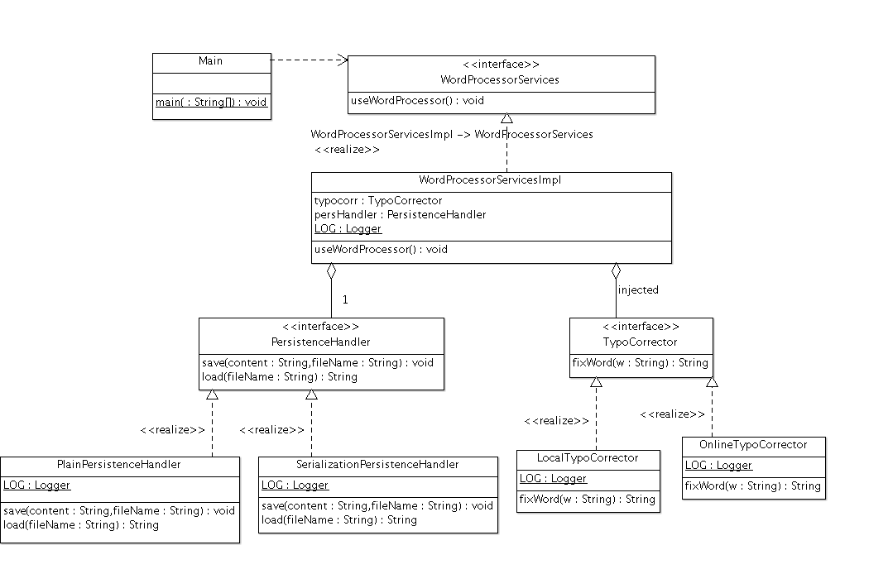

### Escuela Colombiana de Ingeniería
### Procesos de Desarrollo de Software - PDSW

### Contenedores Livianos e inyección de dependencias. Ejercicio de referencia.

El siguiente, es un modelo de clases equivalente a uno de los ejercicios planteados anteriormente, donde se hace uso del principio de Inversión de Dependencias para dejar abierto para extensión (y a la vez, cerrado para modificación), las características de persistencia de los documentos y las estrategias de corrección ortográfica:

A diferencia del ejercicio anterior, donde se hacía uso del patrón Factory Method, en este se hace uno de un Contenedor Liviano ([GoogleGuice](https://github.com/google/guice)), el cual soporta la inyección de dependencias.

1. Ejecute el programa principal y revise su funcionamiento.

2. Revise la manera como a la clase WordProcessorServicesImpl se le define, mediante la anotación @Inject, qué atributos se le deben resolver (inyectar) al momento de ser creado a través de Guice (ya no con 'new').

3. Revise en la clase WordProcessorServicesFactory cómo:
    * Se define cómo se resolveran las dependencias (método 'bind')
    * Se construye una instancia de WordProcessorServices.

4. Dado lo anterior, ajuste la configuración de la fábrica para que el programa use el corrector local, y la persistencia en texto plano. Verifique cómo cambia el funcionamiento.

5. Observe que la variante de 'PersistenceHandler' basada en texto plano requiere de un validador de codificación en concreto. Haga un bosquejo del diagrama actualizado (para validarlo en claseo) y haga que:
    * En la clase PlainPersistenceHandler se cumpla con la inversión de depedencias respecto al validador de codificación, ajustando según haga falta las implementaciones actuales de validadores de codificación (UTF8, Unicode).
    * La fábrica que hace uso de Guice, considere dentro de sus 'binds' la manera de resolver la nueva dependencia de la clase PlainPersistenceHandler (o cualquier otra que llegara a requerir un validador de codificación).

6. Verifique el funcionamiento. Se debería poder, con sólo cambiar la configuración de la fábrica, la combinación de configuraciones, por ejemplo:
    * Corrector local, Persistencia con serialización.
    * Corrector local, Persistencia en texto plano con codificación UNICODE.
    * Corrector en línea, Persistencia en texto plano con codificación UTF8.
    * etc...